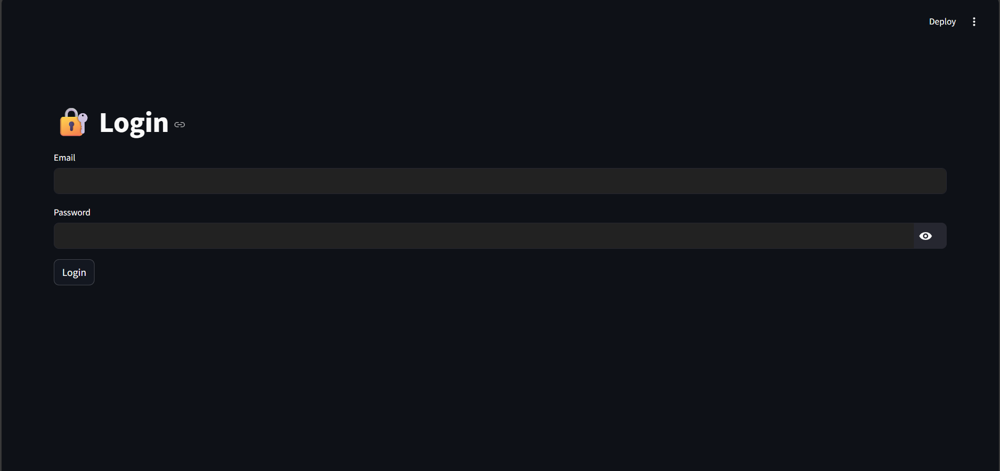
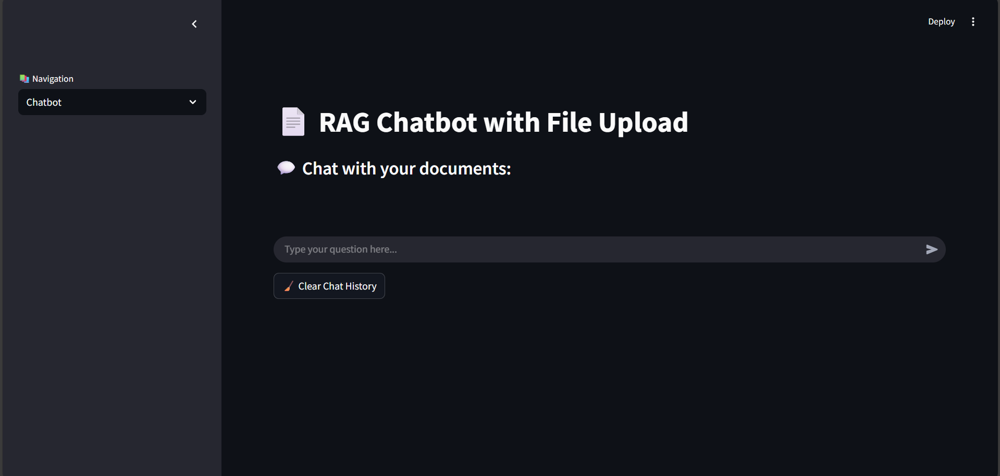
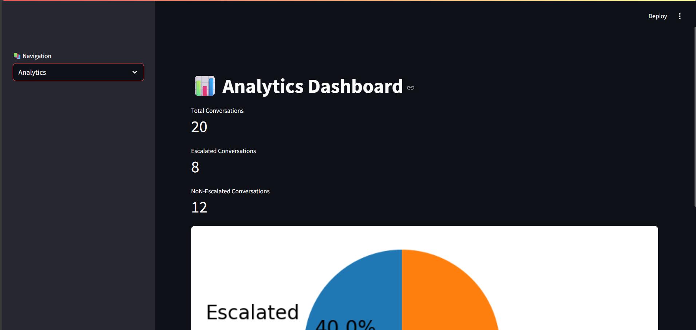

# 🤖 FAQ Chat Bot

A secure and intelligent **FAQ-based Retrieval-Augmented Generation (RAG) Chatbot** with escalation handling, analytics, and admin login interface. Built with **Streamlit** for frontend and **FastAPI** for backend, using **LangChain**, **FAISS**, and **PostgreSQL**.

---

## ✨ Features

- 🔐 **Login**
- 💬 **FAQ Chatbot** (RAG-based with LangChain + Groq)
- 🧠 **Intent Detection & Escalation Handling**
- 📊 **Real-time Analytics Dashboard**
- 🗄️ **PostgreSQL** for Escalation Logging
- ⚙️ **LangChain + HuggingFace + Groq Integration**

---

## 🖥️ UI Preview

| Login | Chatbot | Analytics |
|-------|---------|-----------|
|  |  |  |

---

## 📁 Project Structure

```
FAQ-Chat-Bot/
├── frontend/
│   └── app.py                  # Streamlit app (Login + Chat + Analytics)
├── backend/
│   ├── main.py                 # FastAPI application
│   ├── llm_.py                 # RAG pipeline (LangChain + Groq)
│   ├── inent_detemain.py       # Intent detection and escalation logic
│   ├── models_schema.py        # PostgreSQL model (Tortoise ORM)
│   └── email_page.py           # Escalation email notifier
├── requirements.txt
├── .env                        # Environment variables
└── README.md
```

---

## ⚙️ Tech Stack

- **Frontend:** Streamlit
- **Backend:** FastAPI
- **Vector Store:** FAISS
- **Embedding Model:** HuggingFace
- **LLM:** Groq (Mistral via LangChain)
- **Database:** PostgreSQL (via Tortoise ORM)

---

## 🔐 Admin Login

```text
Email: surya.tvm.apm@gmail.com
Password: admin123
```

> You can change the credentials in `frontend/app.py` for production.

---

## 🧠 Escalation Logic

- Escalation triggered by:
  - Low confidence in FAQ match
  - Unrecognized intent
- On escalation:
  - Escalation message stored in PostgreSQL
  - Notification sent (e.g., email)

---

## 📊 Analytics API

The following endpoint provides chatbot performance stats:

**GET** `/analytics/update`

```json
{
  "total": 10,
  "escalated": 3,
  "not_escalated": 7
}
```

---

## 🛠️ Setup Guide

### 1️⃣ Clone the Repository

```bash
git clone https://github.com/yourusername/FAQ-Chat-Bot.git
cd FAQ-Chat-Bot
```

### 2️⃣ Create Virtual Environment

```bash
python -m venv venv
source venv/bin/activate  # On Windows: venv\Scripts\activate
```

### 3️⃣ Install Dependencies

```bash
pip install -r requirements.txt
```

### 4️⃣ Create `.env` File

```env
GROQ_API_KEY=your_groq_api_key
```

---

## 🗄️ Database Setup

Ensure PostgreSQL is running locally and update your DB URL in `backend/main.py`:

```python
db_url = "postgres://postgres:<password>@localhost:5432/postgres"
```

Tortoise ORM will automatically create tables on first run.

---

## 🚀 Running the Project

### 🖥️ Backend (FastAPI)

```bash
cd backend
uvicorn main:app --host 0.0.0.0 --port 8050 --reload
```

### 💻 Frontend (Streamlit)

```bash
cd frontend
streamlit run app.py
```

---

## 🧪 Test the Bot

- Upload your **FAQ PDF**
- Ask relevant questions from the document
- Try an unrelated question to trigger escalation
- Check the **analytics dashboard** for updates

---

## 📦 Requirements

- Python 3.9+
- PostgreSQL
- Groq API Key

---

## 📃 License

This project is licensed under the [MIT License](LICENSE).

---

## 🙏 Acknowledgments

- [LangChain](https://www.langchain.com/)
- [FAISS](https://github.com/facebookresearch/faiss)
- [Streamlit](https://streamlit.io/)
- [FastAPI](https://fastapi.tiangolo.com/)
- [Groq](https://groq.com/)
- [HuggingFace](https://huggingface.co/)

---

## 🤝 Contributing

Pull requests are welcome! For major changes, please open an issue first.

---

## 📬 Contact

For questions or support, email: **surya.tvm.apm@gmail.com**